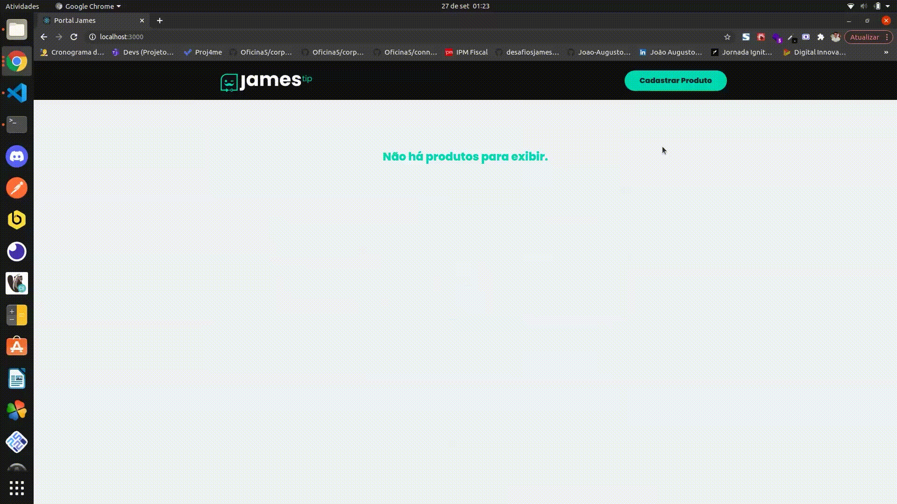

<div align=center>

<h3>

Desafio desenvolvido no processo seletivo da [JamesTip], com **ReactJS**, **Typescript** e **styled-components**.

</h3>



</div>

## 📚 **Sobre**

Plataforma de CRUD de produtos.

- Cria, altera e exclui produtos.
- Listagem dos produtos criados.
- Validação e tratamento de erro dos formulários de criação e edição.
- Persistência dos dados no localStorage.
- Design responsivo.

<br>

### 📌 **Tecnologias utilizadas**

- ReactJS
- Context-api
- React-router-dom
- Typescript
- Styled-components
- localStorage

<br>

### 🚀 **Mão na massa**

```bash
# Clone este repositório
$ git clone https://github.com/Joao-Augusto-Oliveira/james

# Acesse a pasta do projeto no terminal/cmd
$ cd desafio-front-end

# Instale as dependências
$ npm install

# Execute a aplicação em modo de desenvolvimento
$ npm start

```

<br>
<br>

<h3 align="center">
Feito com 💜 por <a href="https://www.linkedin.com/in/joão-augusto-oliveira-dos-santos-9b0693195">João Augusto</a>
<br><br>
</h3>

<!-- Links -->

[jamestip]: https://jamestip.com/
